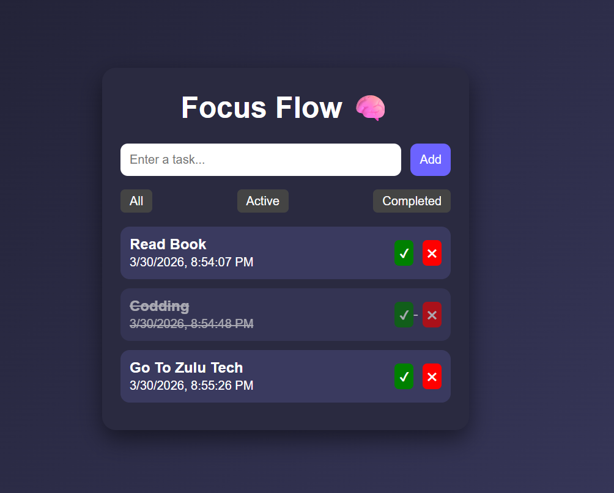

# Week-1-Frontend-Internship-Task

## Overview

This is a simple frontend project for a Week 1 internship task. It includes a static HTML page with CSS styling and minimal JavaScript interactivity.

## Project Structure

- `index.html` - Main HTML file.
- `css/style.css` - Project styling.
- `js/app.js` - JavaScript behavior.
- `asset/` - Assets folder, includes example image(s).
  - `Screenshot 1.png` - Main UI preview image.

## Live Preview

Open `index.html` in any modern browser.

## Screenshot

## Features

- Responsive layout (based on CSS rules in `css/style.css`).
- Basic interactivity from `js/app.js`.
- Clean design for early frontend tasks.

## How to Run

1. Clone or download repository.
2. Open `index.html` in a browser.
3. If you use Live Server extension (VS Code), run it for auto-refresh while editing.

## Development Notes

- CSS is in `css/style.css`. Customize colors, fonts and responsive breakpoints as needed.
- JS behavior is in `js/app.js`.

---

## Author

Project by internship candidate (Week 1 frontend task).
